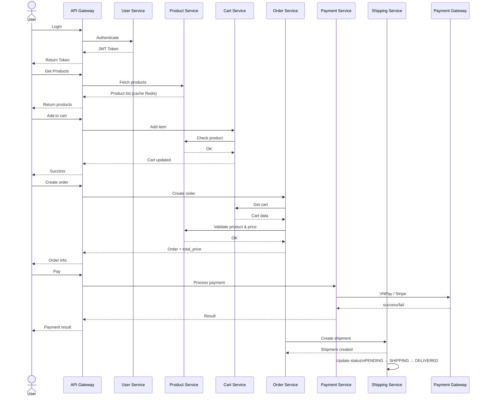
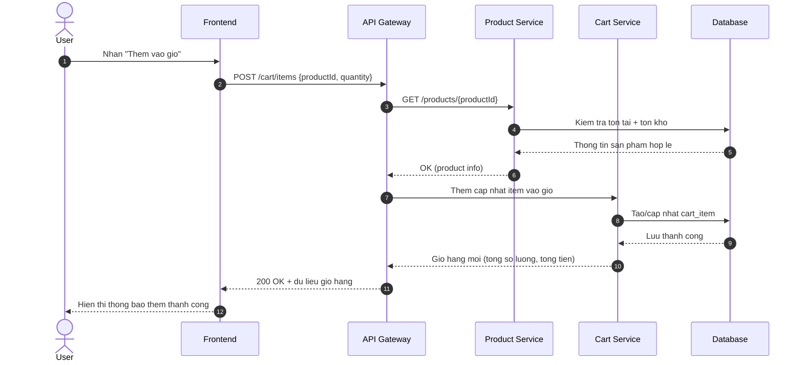
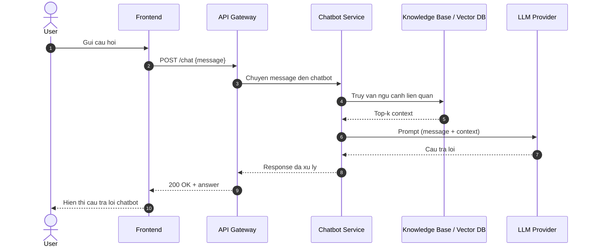

# SA-AD_EMCOMERCE_AI

## Chuc nang mua hang end-to-end

```mermaid
sequenceDiagram
    actor User
    participant Gateway as API Gateway
    participant UserService as User Service
    participant ProductService as Product Service
    participant CartService as Cart Service
    participant OrderService as Order Service
    participant PaymentService as Payment Service
    participant ShippingService as Shipping Service
    participant External as Payment Gateway

    %% Đăng nhập
    User->>Gateway: Login
    Gateway->>UserService: Authenticate
    UserService-->>Gateway: JWT Token
    Gateway-->>User: Return Token

    %% Xem sản phẩm
    User->>Gateway: Get Products
    Gateway->>ProductService: Fetch products
    ProductService-->>Gateway: Product list (cache Redis)
    Gateway-->>User: Return products

    %% Thêm vào giỏ
    User->>Gateway: Add to cart
    Gateway->>CartService: Add item
    CartService->>ProductService: Check product
    ProductService-->>CartService: OK
    CartService-->>Gateway: Cart updated
    Gateway-->>User: Success

    %% Tạo đơn hàng
    User->>Gateway: Create order
    Gateway->>OrderService: Create order
    OrderService->>CartService: Get cart
    CartService-->>OrderService: Cart data
    OrderService->>ProductService: Validate product & price
    ProductService-->>OrderService: OK
    OrderService-->>Gateway: Order + total_price
    Gateway-->>User: Order info

    %% Thanh toán
    User->>Gateway: Pay
    Gateway->>PaymentService: Process payment
    PaymentService->>External: VNPay / Stripe
    External-->>PaymentService: success/fail
    PaymentService-->>Gateway: Result
    Gateway-->>User: Payment result

    %% Giao hàng
    OrderService->>ShippingService: Create shipment
    ShippingService-->>OrderService: Shipment created
    ShippingService->>ShippingService: Update status\nPENDING → SHIPPING → DELIVERED
```

## Sequence Diagram - Chuc nang them gio hang

```mermaid
sequenceDiagram
	autonumber
	actor U as User
	participant FE as Frontend
	participant API as API Gateway
	participant PS as Product Service
	participant CS as Cart Service
	participant DB as Database

	U->>FE: Nhan "Them vao gio"
	FE->>API: POST /cart/items {productId, quantity}
	API->>PS: GET /products/{productId}
	PS->>DB: Kiem tra ton tai + ton kho
	DB-->>PS: Thong tin san pham hop le
	PS-->>API: OK (product info)
	API->>CS: Them cap nhat item vao gio
	CS->>DB: Tao/cap nhat cart_item
	DB-->>CS: Luu thanh cong
	CS-->>API: Gio hang moi (tong so luong, tong tien)
	API-->>FE: 200 OK + du lieu gio hang
	FE-->>U: Hien thi thong bao them thanh cong
```

## Sequence Diagram - Chuc nang chatbot

```mermaid
sequenceDiagram
	autonumber
	actor U as User
	participant FE as Frontend
	participant API as API Gateway
	participant BOT as Chatbot Service
	participant KB as Knowledge Base / Vector DB
	participant LLM as LLM Provider

	U->>FE: Gui cau hoi
	FE->>API: POST /chat {message}
	API->>BOT: Chuyen message den chatbot
	BOT->>KB: Truy van ngu canh lien quan
	KB-->>BOT: Top-k context
	BOT->>LLM: Prompt (message + context)
	LLM-->>BOT: Cau tra loi
	BOT-->>API: Response da xu ly
	API-->>FE: 200 OK + answer
	FE-->>U: Hien thi cau tra loi chatbot
```
